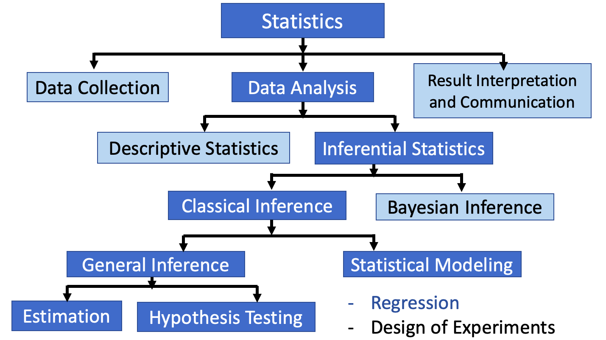

```{r setup, include=FALSE}
options(htmltools.dir.version = FALSE)
library(kableExtra)
```

```{r xaringan-themer, include=FALSE, warning=FALSE}
library(xaringanthemer)
style_duo_accent(
  primary_color = "#ffffff",
  title_slide_text_color = "#081d58", 
  secondary_color = "#ffffff",
  inverse_header_color = "#081d58",
  text_font_size = "1.1em",
  text_color = "#000",
  text_bold_color = "#fd8d3c",
  link_color = "#1f78b4",
  header_color = "#081d58"

  
)
```


class: center, middle, inverse


## Welcome to CM 4450 Computational Bayesian Statistics!!!

---
class: center, middle, inverse
# Outline Syllabus 

--
Please refer the course outline!!

---

# Pre-requisites 

CM 1310 Linear Algebra and Calculus

CM 1410 Probability and Statistics

CM 2420 Statistical Inference
---

**CM 2420 Statistical Inference**


```{r   out.width = "80%", echo = FALSE, fig.align='center'}

```

---

background-image: url('fig/s8f.png')
background-position: 50% 50%
background-size: 80%
class: left, top

---
background-image: url('fig/s9k.png')
background-position: 50% 50%
background-size: 80%
class: left, top


<!-- Polymerase chain reaction (PCR) is a method widely used to rapidly make millions to billions of copies (complete copies or partial copies) of a specific DNA sample, allowing scientists to take a very small sample of DNA and amplify it (or a part of it) to a large enough amount to study in detail.

 PCR only works on DNA, and the COVID-19 virus uses RNA as its genetic code. RNA is similar to DNA, but only has a single strand.
-->

---

## The main difference is how parameters are treated:

**Frequentist approach:** Parameters are fixed (constant but unknown). They are not random; only the data is random. We estimate parameters using data (e.g., point estimates, confidence intervals).

In the frequentist view, probability is defined as the long-run relative frequency of an event when an experiment is repeated many times under the same conditions.

**Bayesian approach:** Parameters are treated as random variables with a probability distribution. We update this distribution using data to get a posterior.
